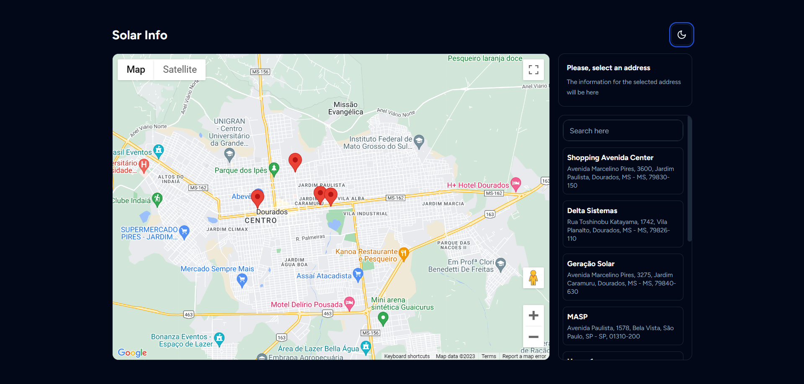

# SolarApp Test

Website created as a technical test for [Delta Sistemas](https://deltasistemas.net/).

You can visit the project by [clicking here](https://solarapp-test.vercel.app/)



## Instalação

1. Clone the repository: `git clone https://github.com/rodrigoqueiroz12/solarapp-test.git`
2. Navigate to the project directory: `cd .\solarapp-test\`
3. Run the project

```bash
npm run dev
# or
yarn dev
# or
pnpm dev
# or
bun dev
```

## Contato

If you'd like to get in touch, you can reach me at [rodrigo.queiroz0629@gmail.com].
